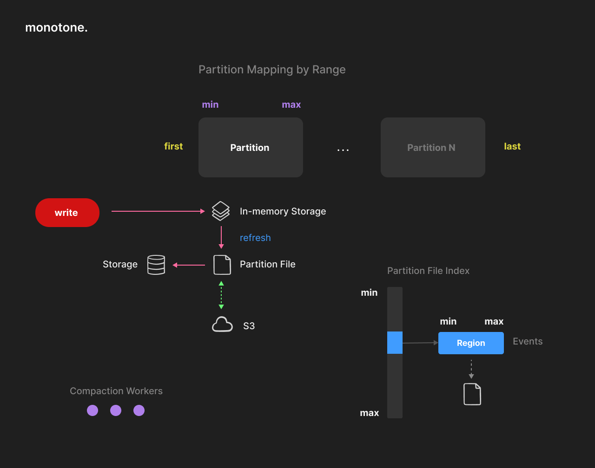

#### Architecture

Monotone architecture is inspired by the Log-Structured approach and implements a custom-made memory-disk-cloud
hybrid data storage engine.

The whole database can be seen as a 64-bit range sparse array of ordered events.
Data is stored in sorted partition files.
Each partition has an associated `[min, max]` range. Partitions never overlap.

An event is a combination of 64-bit id (or time) and key/value raw data `[id, key, value]`.
The event `id` and the optional `key` represent a serial (or time) compound primary key.
Events are designed to store any kind of unstructured data.

It is correct to say that monotone is an embeddable cloud-native serial (time-based) key-value
storage for events that support automatic range partitioning and advanced data management.

#### Partitioning

Each partition file contains sorted regions.
Regions represent a sorted list of events, variable in size and compressed (~150KiB or more).
Region size can affect compression efficiency and reduce the number of requests required to fulfill a scan
(fewer round trips to the cloud).

Each partition has ordered in-memory storage associated with the partition file.
Eventually, the in-memory storage and partition file are merged together.
This is done manually or in the background by a pool of workers.
Compaction is multi-threaded and scalable.
Each partition file has an index of regions, which contains the min/max keys of each region and its file position.
This index is kept in memory and loaded on start. The index size is insignificant, even for huge data sets.

#### Refresh

Partition refresh does not block readers and writers.
Partitions can be updated or read while being refreshed without blocking.
This is implemented by switching the partition to the second in-memory storage and doing so in several short locking stages.
Storage is designed to survive and automatically recover from crashes, which could potentially happen during a refresh (power outage).

Refresh automation is designed to reduce write-amplification as much as possible.
Ideally, the partition should be written once, using only memory storage as a source.
Partition refresh is scheduled automatically when the partition reaches its refresh watermark (or can be done manually at any time).

#### In-Memory Storage

In-memory storage (memtable) was implemented using a T-tree style data structure to reduce pointers overhead and increase data locality.
Each partition uses a custom-made memory allocator context optimized for sequential write
and atomic free of large memory regions.
This solves the problem of memory fragmentation of malloc, greatly improves data locality,
and allows multi-threaded compaction to work without affecting other threads.
Furthermore, the allocator is optimized for using Linux Huge Pages by design (but not mandatory).

#### Read

Range scans are optimized for reduced IO and the idea that they can work on top of a cloud.
Unlike typical B-tree or LSM trees, Monotone storage is never required to do more than one read at a time to an
underlying storage device or a cloud service when using cursors.
This is possible to do because the region index is kept in memory.
Each cursor is doing a merge join between the partition file region and in-memory storages (one or two in case of the parallel refresh).

#### Write

Write operations never require disk access and are done in memory (with the optional use of WAL for persistence).
After a successful write, data is immediately available for further reading without delay.
Any written event can be deleted or updated in the future (the same as in a typical key-value storage).
Writing is done in batches and is transactional (atomical).
Batching is primarily necessary to increase performance when using WAL.

Write only succeeds if data is written to WAL.
It is also possible to disable WAL for higher performance if it is not critical to lose the latest updates,
which were not yet refreshed and synced with the disk.
Write-ahead logs are automatically deleted when data are saved to partitions.

#### Locking

Storage does not implement any kind of MVCC or Snapshot Isolation.
This is done consciously to avoid problems with the unavoidable necessity for garbage collection (VACUUM).
Instead, locking is done per partition, which is more in line with the common usage patterns.
It is possible to read and write to different partitions without blocking each other.
Storage is designed to work in multi-threaded applications.
