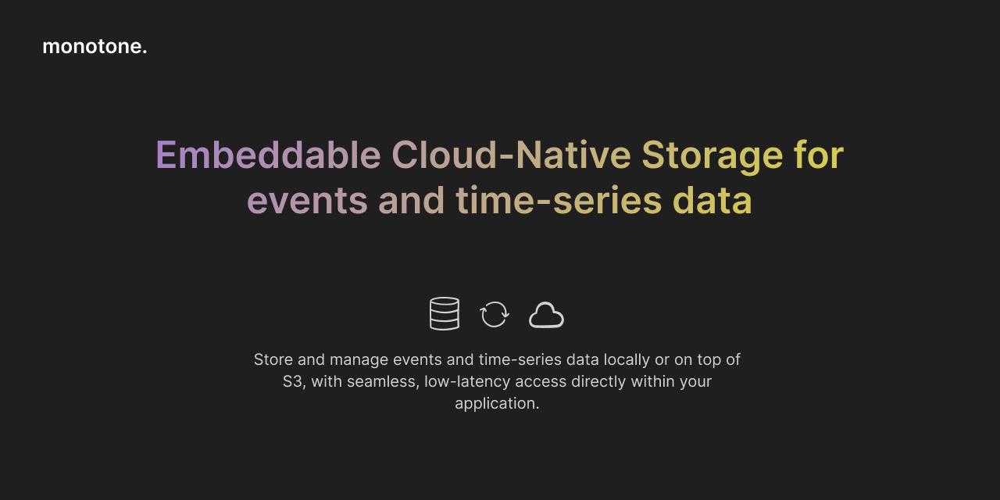

### Monotone QA and Testing

Monotone is using a custom-made test suite.

Test [Plan](plan).

#### Testing Groups

- `functional`

  Basic CRUD and Partition mapping.

- `storage` 

  Storage-specific DDL commands, data management, compression, and encryption.

- `cloud`

  Cloud-specific DDL commands are tested using the cloud mock interface.

- `recovery`

  Storage behavior after restart, WAL, crash recovery, and error injections.

- `s3`

  S3 testing using `minio` (which is required to be run locally). These tests must be run explicitly.

#### Memory testing

`Valgrind` is an essential tool for memory testing.

Our policy is that Valgrind should have no warnings or leaks when running the test suite.
